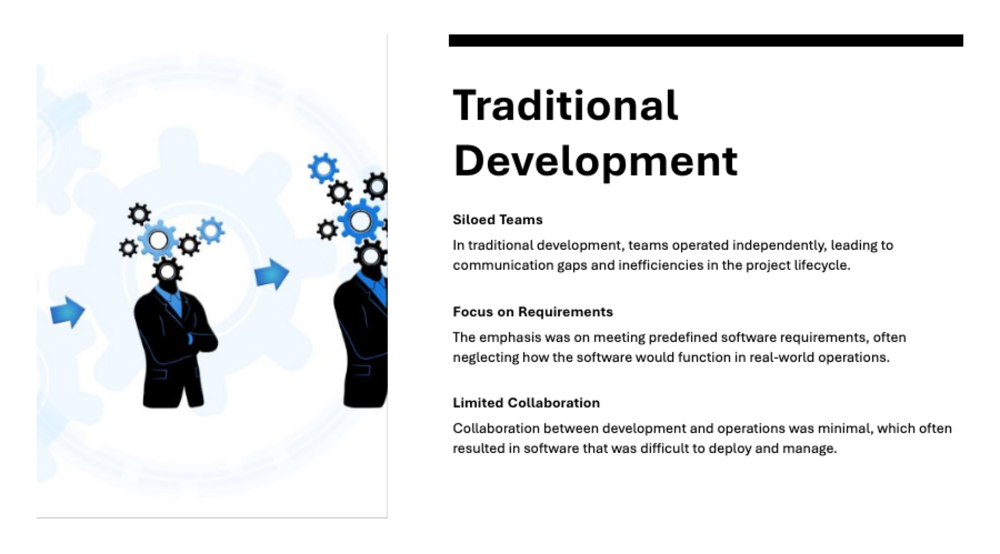

= DevOps and Agile Concepts for Beginners
:toc: right
:toclevels: 5
:sectnums: 5

---

---

---

---

---

---

---

---

---

---

---

---

---

---

== DevOps Concepts

DevOps is a combination of *Development (Dev)* and *Operations (Ops)* practices aimed at improving collaboration and automation throughout the software development lifecycle. Below are key concepts:

=== What is DevOps?

* DevOps is a culture that bridges the gap between software development and IT operations.
* It emphasizes automation, collaboration, and continuous delivery of software.

=== Key Principles of DevOps

1. *Collaboration*: Promotes open communication between development, QA, and operations teams.
2. *Automation*: Automates repetitive tasks like code integration, testing, deployment, and monitoring.
3. *Continuous Integration and Continuous Delivery (CI/CD)*:
* CI: Developers integrate code changes frequently into a shared repository.
* CD: Automates the deployment of code changes to production environments.
4. *Monitoring and Feedback*: Tracks system performance and gathers user feedback for continuous improvement.

=== DevOps Tools

*CI/CD Tools*:
- Jenkins, CircleCI, GitLab CI/CD

*Version Control Systems*:
- Git, Bitbucket

*Configuration Management*:
- Ansible, Chef, Puppet

*Containerization*:
- Docker, Kubernetes

*Monitoring Tools*:
- Nagios, Prometheus, Grafana

=== Benefits of DevOps

* Faster delivery of software with reduced errors.
* Improved collaboration between teams.
* High reliability and better software quality.

== Agile Concepts

Agile is a project management and software development methodology that emphasizes iterative and incremental work cycles, called *sprints*. Below are key concepts:

=== What is Agile?

* Agile promotes flexibility, collaboration, and customer-centricity in software development.
* It breaks down projects into smaller, manageable pieces that can be delivered incrementally.

=== Core Principles of Agile

1. *Individuals and Interactions* over processes and tools.
2. *Working Software* over comprehensive documentation.
3. *Customer Collaboration* over contract negotiation.
4. *Responding to Change* over following a plan.

=== Agile Frameworks

1. *Scrum*: Focuses on time-boxed sprints and roles like Scrum Master, Product Owner, and Team Members.
2. *Kanban*: Visualizes work items on a board for better workflow management.
3. *Extreme Programming (XP)*: Emphasizes technical practices like Test-Driven Development (TDD) and pair programming.

=== Agile Process Flow

1. *Planning*: Define the project backlog and prioritize tasks.
2. *Sprint Execution*: Work on tasks in short sprints (e.g., 2 weeks).
3. *Daily Stand-ups*: Conduct quick meetings to discuss progress and obstacles.
4. *Review*: Demonstrate the completed tasks to stakeholders.
5. *Retrospective*: Reflect on the sprint to improve processes.

=== Benefits of Agile

* Rapid delivery of valuable software.
* Flexibility to adapt to changing requirements.
* Enhanced collaboration with stakeholders.
* High customer satisfaction through continuous feedback.

== Transition from Manual Testing to Automation Using DevOps and Agile

1. *Start with Agile Practices*: Understand your role in the Agile team, attend daily stand-ups, and collaborate with developers and QA.
2. *Learn Automation Tools*: Familiarize yourself with Selenium, TestNG, or JUnit.
3. *Integrate Testing in DevOps*: Use CI/CD pipelines to automate testing tasks.
4. *Focus on Continuous Learning*: Stay updated on DevOps tools and Agile best practices.

