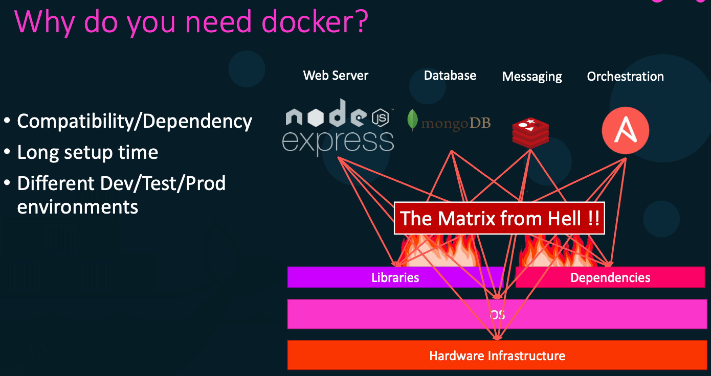
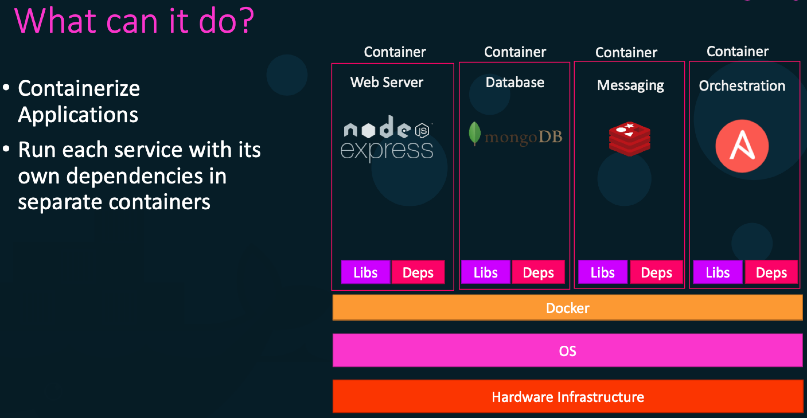
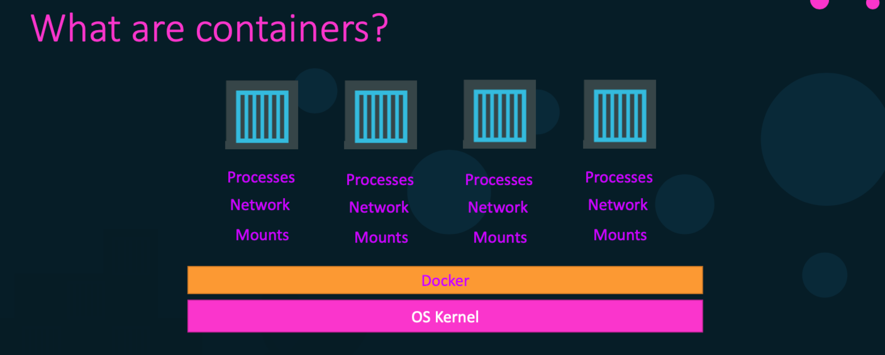
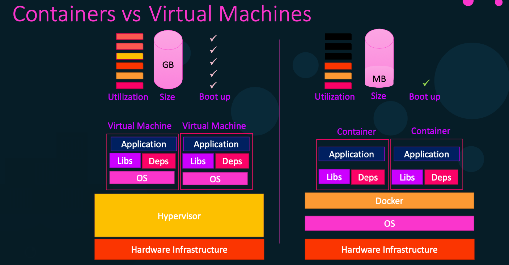

= Dockers
:toc: right
:toclevels: 5
:sectnums: 5

== The Matrix from Hell and Docker

*"The Matrix from Hell"* refers to the overwhelming complexity of managing and testing software across multiple combinations of environments, such as different operating systems, runtime versions, dependencies, and configurations. This complexity increases exponentially with each additional variable.

*Challenges of The Matrix from Hell*

- *Environment Combinations*: Testing software across numerous combinations of OS, library versions, and configurations.
- *Inconsistent Results*: Bugs that appear in one environment but not in another due to subtle differences.
- *Deployment Variability*: Applications working on a developer’s machine but failing in staging or production (*"It works on my machine"* problem).

*How Docker Solves "The Matrix from Hell"*

Docker simplifies this complexity by isolating and standardizing environments in containers. Here's how:

- *Consistent Environments*:
  Containers bundle the application, dependencies, and configurations into a single portable unit, ensuring consistency across machines and teams.

- *Isolation*:
  Each container runs independently, preventing conflicts between software versions or dependencies. Multiple containers with different setups can run simultaneously on the same machine without interference.

- *Reproducibility*:
  Dockerfiles define environments in a repeatable way, eliminating discrepancies. Bugs can be reliably reproduced by sharing the same container.

- *Parallel Testing*:
  Containers allow running multiple environment combinations in parallel, automating tests without manually configuring machines.

*Example of Using Docker to Avoid "The Matrix from Hell"*

*Scenario*: An application must be tested with:
- Python 3.8, 3.9, and 3.10
- PostgreSQL 12 and 13

*Without Docker*
Manually install and configure different Python and PostgreSQL versions on separate systems. This is time-consuming and error-prone.

*With Docker*

Use containers to represent each combination:

[source,bash]
----
# Test with Python 3.8 and PostgreSQL 12
docker run -d --name test-python3.8-postgres12 python:3.8
docker run -d --name postgres12 -e POSTGRES_PASSWORD=pass postgres:12

# Test with Python 3.9 and PostgreSQL 13
docker run -d --name test-python3.9-postgres13 python:3.9
docker run -d --name postgres13 -e POSTGRES_PASSWORD=pass postgres:13
----

*Benefits*
- No manual configuration required.
- Tests can run simultaneously for different combinations.
- Ensures consistent and reproducible results.

*Conclusion*

Docker transforms the nightmare of managing *"The Matrix from Hell"* into an efficient and manageable process. By using containers, developers and automation engineers can simplify testing and deployment across diverse environments, ensuring reliability and consistency.

---

---

---

*Docker vs Virtual Machines*

Docker and Virtual Machines (VMs) are both used to create isolated environments for running applications, but they work differently and have distinct use cases.

*Key Differences*

*1. *Architecture*
- *Docker*: Containers share the host operating system (OS) kernel, making them lightweight and faster to start.
- *Virtual Machines*: Each VM includes a full operating system, making them larger and slower to start.

[cols="2,2",options="header"]
|===
| Feature | Comparison
| Base | Docker uses the host OS. VMs use a hypervisor to virtualize hardware.
| Overhead | Docker has minimal overhead. VMs have high overhead due to full OS installations.
| Start Time | Docker containers start in seconds. VMs take minutes to boot up.
|===

*2. *Resource Usage*
- *Docker*: Containers are lightweight because they share resources with the host machine.
- *Virtual Machines*: VMs are heavier since each one needs its own OS and allocated hardware resources.

[cols="2,2",options="header"]
|===
| Feature | Comparison
| Memory Usage | Containers use less memory. VMs use more memory.
| Storage Space | Containers require less disk space. VMs take up significant space.
| Performance | Containers are faster for most tasks. VMs can be slower due to resource overhead.
|===

*3. *Portability*
- *Docker*: Containers are portable and can run anywhere Docker is installed.
- *Virtual Machines*: VMs are less portable due to their size and dependency on specific hypervisors.

*4. *Use Cases*
- *Docker*: Ideal for microservices, CI/CD pipelines, testing, and applications that need fast, lightweight environments.
- *Virtual Machines*: Best for running multiple OS types, legacy applications, or when full OS isolation is required.

*Summary Table*

[cols="1,2,2",options="header"]
|===
| Feature | Docker | Virtual Machines
| Operating System | Shares host OS kernel | Includes a full OS
| Performance | Lightweight, fast | Heavier, slower
| Portability | Highly portable | Limited portability
| Resource Usage | Minimal | High
| Use Cases | Microservices, testing, CI/CD | Full OS isolation, legacy apps
|===

*Conclusion*

Docker is a lightweight and efficient tool for application development and testing, while Virtual Machines are better for scenarios that need complete OS isolation. Choose the right tool based on your specific needs.

Let me know if you'd like to expand on any section or add more details!

---

== Docker Basics for Automation Engineers

Docker is a platform that allows you to develop, ship, and run applications in isolated environments called *containers*. Containers are lightweight and portable, making them ideal for automating software development and testing.

== Key Concepts

*Container*: A lightweight and portable executable package that includes everything needed to run an application (code, libraries, dependencies).

*Image*: A template used to create containers. It is a read-only file that contains the application and environment settings.

*Dockerfile*: A text file that contains a set of instructions to build a Docker image.

*Docker Engine*: The core part of Docker that runs and manages containers.

*Registry*: A storage and distribution system for Docker images, such as Docker Hub.

== Benefits of Docker

- *Consistency*: Ensures the application works the same in every environment.
- *Efficiency*: Containers share the host OS kernel, making them faster and more resource-efficient than virtual machines.
- *Scalability*: Easily scale applications by deploying multiple container instances.
- *Portability*: Containers can run anywhere – on a developer's laptop, on-premise servers, or in the cloud.

== Basic Docker Commands

[source,bash]
----
# Pull a Docker image from Docker Hub
docker pull <image-name>

# Run a container from an image
docker run <image-name>

# List running containers
docker ps

# Stop a running container
docker stop <container-id>

# Build an image from a Dockerfile
docker build -t <image-name> .

# Remove a container
docker rm <container-id>

# Remove an image
docker rmi <image-name>
----

== Real-World Use Cases for Automation Engineers

=== 1. Testing Applications in Isolated Environments
*Scenario*: You need to test an application across different versions of Python or Java.
*Solution*: Use Docker to create containers for each version and run your tests in these isolated environments.

[source,bash]
----
# Example: Running tests in a Python 3.9 container
docker run -it --rm python:3.9 python --version
----

=== 2. Running Selenium Grid for Browser Automation
*Scenario*: You want to run automated browser tests using Selenium Grid.
*Solution*: Use Docker to set up Selenium Hub and browser nodes.

[source,bash]
----
# Start the Selenium Hub
docker run -d -p 4444:4444 --name selenium-hub selenium/hub

# Start a Chrome browser node
docker run -d --link selenium-hub:hub selenium/node-chrome
----

=== 3. Setting Up Test Databases
*Scenario*: You need a MySQL database for testing but don’t want to install it locally.
*Solution*: Use a MySQL Docker image to create a containerized database.

[source,bash]
----
# Run a MySQL container
docker run -d --name test-db -e MYSQL_ROOT_PASSWORD=root -e MYSQL_DATABASE=test -p 3306:3306 mysql:latest
----

=== 4. CICD Pipeline Integration
*Scenario*: You want to automate application deployment in a CI/CD pipeline.
*Solution*: Use Docker images to ensure consistent build environments across development, testing, and production stages.

== Summary
Docker is an essential tool for automation engineers, offering consistency, efficiency, and scalability. By leveraging containers, engineers can streamline their testing and deployment processes, ensuring smooth and reliable automation workflows.

---

== Questions

Here are 10 basic objective interview questions on Docker:

1. What is Docker primarily used for?
A. Virtualization of hardware
B. Containerization of applications
C. Cloud storage
D. Network monitoring

.Click Here For Answer
[%collapsible]
====
The answer is *B*
====

2. Which of the following is *NOT* a core component of Docker?
A. Docker Engine
B. Docker Hub
C. Docker Cloud
D. Docker Compose

.Click Here For Answer
[%collapsible]
====
The answer is *C*
====

3. Which command is used to list all running Docker containers?
A. `docker ps`
B. `docker images`
C. `docker start`
D. `docker run`

.Click Here For Answer
[%collapsible]
====
The answer is *A*
====

4. What is the default file name for defining Docker services?
A. `docker-compose.yaml`
B. `docker-service.yaml`
C. `dockerfile.yaml`
D. `docker.yaml`

.Click Here For Answer
[%collapsible]
====
The answer is *A*
====

5. What does a Docker image contain?
A. The operating system kernel
B. All application dependencies
C. A running application instance
D. User configurations only

.Click Here For Answer
[%collapsible]
====
The answer is *B*
====

6. What is the purpose of Docker volumes?
A. To expose application ports
B. To manage network configurations
C. To persist container data
D. To manage resource limits

.Click Here For Answer
[%collapsible]
====
The answer is *C*
====

7. Which command is used to build a Docker image from a Dockerfile?
A. `docker build`
B. `docker run`
C. `docker pull`
D. `docker create`

.Click Here For Answer
[%collapsible]
====
The answer is *A*
====

8. What is Docker Hub?
A. A tool for running containers
B. A registry for Docker images
C. A monitoring service
D. A networking tool

.Click Here For Answer
[%collapsible]
====
The answer is *B*
====

9. How do you stop a running container in Docker?
A. `docker remove`
B. `docker stop`
C. `docker end`
D. `docker pause`

.Click Here For Answer
[%collapsible]
====
The answer is *B*
====

10. What is the role of `docker-compose`?
A. Building images
B. Managing multiple containers
C. Pushing images to Docker Hub
D. Creating Docker volumes

.Click Here For Answer
[%collapsible]
====
The answer is *B*
====
