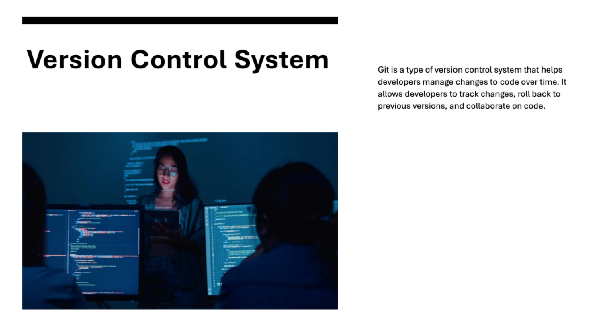

= Git and GitHub
:toc: right
:toclevels: 5
:sectnums: 5

== What is GIT: Deck

---


---


---


---



---


---

image::git/git6.png[]

---


---


---


== Comparison: Git vs. SVN

Git and SVN are both version control systems, but they differ significantly in features and workflows. Below is a detailed comparison:

[cols="2,2,2"]
|===
| Feature | Git | SVN

| Type
| Distributed Version Control System (DVCS)
| Centralized Version Control System (CVCS)

| Repository
| Each developer has a complete copy of the repository, including its history.
| Developers work with a central repository, with local copies of files only.

| #Branching and Merging#
| Lightweight and fast. Each branch is independent, enabling easy experimentation.
| Heavyweight and slower. Branches are essentially directories and can be harder to manage.

| Offline Work
| Full repository allows offline access to history and commits.
| Requires connectivity to the central server for most operations.

| Performance
| Faster due to local operations (e.g., commits, logs, and diffs).
| Slower since most operations require server communication.

| Data Integrity
| Ensures data integrity with cryptographic hashing (SHA-1).
| Relies on file modification timestamps, making it slightly less secure.

| Storage Efficiency
| Compact storage due to shared object structure and delta compression.
| Larger storage requirements because each revision stores the full file.

| #Collaboration#
| Easy to collaborate on forks and branches, especially for open-source projects.
| Collaboration is tightly coupled to the central server, requiring strict permission management.

| Learning Curve
| Steeper learning curve due to advanced concepts like staging and rebasing.
| Easier to learn for beginners familiar with centralized workflows.

| Popularity
| Widely used, especially for open-source projects (e.g., GitHub, GitLab).
| Primarily used in legacy or enterprise systems.

|===

*Summary*

*Git* is better suited for distributed teams and open-source projects with complex workflows.

*SVN* may be a good choice for small teams or projects that rely on a centralized model.

---

Git is a distributed version control system widely used for tracking changes in source code during software development. It helps teams collaborate, manage versions, and ensure code integrity.

== What is Git?
* Git is a *Version Control System (VCS)* used to manage changes in files over time.
* It allows developers to work on the same project simultaneously without overwriting each other's work.
* Git tracks changes, who made them, and when they were made.

---

*Features of Git*

* *Distributed:* Every developer has the full repository on their system, not just the latest version.
* *Branching and Merging:* Supports lightweight and efficient branches for experimenting and merging code.
* *Data Integrity:* Ensures the integrity of files with cryptographic hashing.
* *Speed:* Optimized for performance and fast operations.

---

*Why Use Git?*

* *Collaboration:* Enables multiple developers to work on the same codebase efficiently.
* *Version Tracking:* Maintains a history of changes to help identify when and why changes occurred.
* *Backup:* Acts as a backup of the codebase since every developer has a copy of the repository.
* *Code Integrity:* Tracks and prevents accidental overwrites or loss of data.

---

*Key Git Terminologies*

* *Repository (Repo):* A project folder tracked by Git, containing files and a hidden `.git` folder.
* *Commit:* A snapshot of changes made to the repository.
* *Branch:* A separate line of development within a repository.
* *Merge:* Combining changes from one branch into another.
* *Clone:* A copy of a remote repository downloaded to a local system.
* *Pull:* Fetching changes from a remote repository and merging them into the local repository.
* *Push:* Sending local commits to a remote repository.

---

*Installing Git*

To install Git:
* *Windows:* Download Git from https://git-scm.com/, run the installer, and follow the setup instructions.
* *macOS:* Use the Terminal and run `brew install git` if Homebrew is installed.
* *Linux:* Use your package manager, e.g., `sudo apt install git` on Ubuntu.

== Git and Version Control

* Git solves common software development problems related to file versioning and team collaboration. 

* Example scenario:  
  - A boss asks for the removal of an "About" page.  
  - Later, the boss wants the exact "About" page back.  
  - Without Git, this involves recreating the page manually, which is time-consuming.  
  - With Git, previous versions of files are saved and can be restored with a single command.  

* Git tracks every change made to files through *commits*, maintaining a history of versions.  
* Benefits of Git in real-world scenarios:  
  - Easily retrieve changes made by team members.  
  - Resolve conflicts when multiple people edit the same file simultaneously.  
  - Work on multiple versions of the project independently without blocking progress.  
  - Avoid accidental file deletions or overwriting.  
  - Access changes made to a project from anywhere.  

* Git is fast, lightweight, and simple to use.  
* GitHub is an online service providing Git repositories:  
  - Free for public repositories; paid for private ones.  
  - Supports open-source projects.  
  - Alternatives include GitLab, BitBucket, and SourceForge.  

* For this course, GitHub is used due to its popularity and ease of use.  

################

=== Cloning


```
git clone https://github.com/Naresh-Chaurasia/FullStack-Development-1

git remote -v
```

=== Help

`git clone -h`

################

=== Commits

In Git, a commit is a snapshot of your code at a specific point in time. When you commit changes, you’re essentially saving those changes to the Git repository. Each commit typically represents a logical unit of work, like adding a new feature, fixing a bug, or making some improvements. Commits include a commit message that describes the changes made, providing context for anyone looking at the commit history.

In the context of Git, a "snapshot" refers to a complete copy of the state of your project at a specific point in time.

```
git init
git status
git add hello.txt
git status
git commit -m "first commit"
git status
git log
```

################

=== Staging

NOTE: StagedFile.txt and UnStageFile.txt

---

```
echo "hello" > hello.txt
echo "hai" > hai.txt
git status

git add hai.txt
git status

git reset hai.txt
git status
```


---


################################################################################

---


Think of the *staging area in Git* as a middle ground between your working directory (where you make changes) and your Git repository (where your committed changes are stored).

When you make changes to your files, Git doesn't automatically save them to the repository. Instead, you first need to add these changes to the staging area. This is like preparing your changes to be committed. You can think of the staging area as a place where you gather up all the changes you want to include in your next commit.

Once your changes are in the staging area, you can review them and make sure you're happy with what you're about to commit. If you realize you made a mistake, you can modify your changes in the working directory and then add the corrected version to the staging area again.

Once you're satisfied with the changes in the staging area, you commit them to the repository. This saves the staged changes as a snapshot in the Git history, creating a permanent record of your work.

################

=== Branches

TIP: Make a repository in Github and add README.md file.

* Let's say you're working on Feature A for your project.  In the middle of development, a new high priority requirement for Feature B comes in.  You're now forced to pause development on feature A and start feature B.  Then once Feature B is finished, resume development on feature A.

* Git accomplishes this with the concept of branches.  A branch is simply a series of commits that can be manipulated independently.  Git maintains a master branch that is in some sense the source of truth for the project, meaning it  is the code that is currently the most up to date.  Any commit on a branch can be the origin commit where a new branch can be initiated at that point.  Any commit on master will not be seen on the second branch and any commit on the second branch will  not affect master.

* When the development of a feature is complete or at any arbitrary point that we as developers choose,  we can merge two branches effectively bringing all the commits on one branch into another branch.  In our example, our feature branch will bring all the committed parts into the main branch.

---

image::git/branch-2.png[width=500]

---

```
#list all available branches.
git branch

git branch featureBranch

git checkout featureBranch

echo "feature" > feature.txt

git add .

git commit -m "feature commit"

git log
```


################

=== Checking status and inspecting commits

```
git log

git show <hash>

git show --name-only <hash>
```

################

=== Code Checking

* Create a respository on Github with name *Training1*

----
echo "# Training1" >> README.md
git init
git add README.md
git commit -m "first commit"
git branch -M main
git remote add origin git@github.com:Naresh-Chaurasia/Training1.git
git push -u origin main
----

################

*.gitignore*

----
# Java compiled class files
*.class

# Log files
*.log

# BlueJ/DrJava files
*.ctxt

# Mobile Tools for Java (J2ME)
.mtj.tmp/

# Package Files #
*.jar
*.war
*.nar
*.ear
*.zip
*.tar.gz
*.rar

# NetBeans
nbproject/private/
build/
nbbuild/
dist/
nbdist/
.nb-gradle/

# Eclipse
.settings/
bin/
tmp/
*.tmp
*.bak
*.swp
*~.nib
local.properties
.classpath
.project
.settings/
.metadata/
.recommenders/
.gradle/

# IntelliJ IDEA
.idea/
*.iml
*.iws
out/

# VS Code
.vscode/

# Maven
target/
!.mvn/wrapper/maven-wrapper.jar

# Node
node_modules/
dist/
npm-debug.log*
yarn-debug.log*
yarn-error.log*

# JetBrains IDEs
*.idea/
*.iml

# OS generated files
.DS_Store
Thumbs.db

# Custom Maven Wrapper files
.mvn/wrapper/maven-wrapper.properties

# Coveralls output
.coverage/
coverage-final.json
lcov-report/

----

################

################


################


################


== SSH Key Generation

TIP: Install Git Bash

To generate and add an SSH key for GitHub on a Windows machine, follow these steps:

1. *Check for Existing SSH Keys*:
- Open Git Bash and run:
```bash
ls -al ~/.ssh
```
- If you see files like `id_rsa.pub` or `id_ed25519.pub`, you already have an SSH key.

2. *Generate a New SSH Key*:
- In Git Bash, enter the following command (replace `your_email@example.com` with your GitHub email):
```bash
ssh-keygen -t ed25519 -C "your_email@example.com"
```
- If your system doesn’t support `ed25519`, use:
```bash
ssh-keygen -t rsa -b 4096 -C "your_email@example.com"
```

3. *Save the SSH Key*:
- You’ll be prompted to save the key. Press `Enter` to accept the default location (`/c/Users/YourName/.ssh/id_ed25519`).

4. *Set a Passphrase*:
- Optionally, you can enter a passphrase for added security or just press `Enter` for no passphrase.

5. *Add SSH Key to the SSH Agent*:
- Start the SSH agent:
```bash
eval "$(ssh-agent -s)"
```
- Add your SSH key:
```bash
ssh-add ~/.ssh/id_ed25519
```

6. *Copy the SSH Key to Your Clipboard*:
- Use this command to copy your SSH key:
```bash
clip < ~/.ssh/id_ed25519.pub
```
- If you used RSA, the command would be:
```bash
clip < ~/.ssh/id_rsa.pub
```

7. *Add the SSH Key to Your GitHub Account*:
- Go to your GitHub account [SSH and GPG keys settings](https://github.com/settings/keys).
- Click on *New SSH key*, give it a title, and paste your key in the "Key" field.

8. *Test Your SSH Connection*:
- Run the following command to test your connection:
```bash
ssh -T git@github.com
```
- If successful, you should see a message like:
```
Hi username! You've successfully authenticated, but GitHub does not provide shell access.
```

You’re now ready to use SSH with GitHub on Windows!

== Git Objective Questions

1. Which of the following is a Distributed Version Control System?
A. SVN
B. CVS
C. Git
D. Mercurial

.Click Here For Answer
[%collapsible]
====
The answer is C.
====

2. What does the command `git init` do?
A. Initializes a new repository
B. Adds files to staging
C. Clones a repository
D. Deletes a repository

.Click Here For Answer
[%collapsible]
====
The answer is A.
====

3. Which file is used to ignore specific files or directories in a Git repository?
A. .gitignore
B. .gitconfig
C. ignore.txt
D. config.txt

.Click Here For Answer
[%collapsible]
====
The answer is A.
====

4. What command is used to check the status of your Git repository?
A. `git log`
B. `git status`
C. `git commit`
D. `git check`

.Click Here For Answer
[%collapsible]
====
The answer is B.
====

5. What is the default branch name in Git before version 2.28?
A. main
B. default
C. trunk
D. master

.Click Here For Answer
[%collapsible]
====
The answer is D.
====

6. What does `git clone` do?
A. Creates a new branch
B. Copies a repository from a remote server to your local machine
C. Combines branches
D. Pushes changes to the remote repository

.Click Here For Answer
[%collapsible]
====
The answer is B.
====

7. Which of the following commands stages all changes for the next commit?
A. `git add .`
B. `git commit -a`
C. `git push`
D. `git checkout`

.Click Here For Answer
[%collapsible]
====
The answer is A.
====

8. What does the command `git pull` do?
A. Downloads changes from a remote repository and merges them into the local repository
B. Pushes local changes to a remote repository
C. Creates a new branch
D. Deletes a branch

.Click Here For Answer
[%collapsible]
====
The answer is A.
====

9. Which command is used to view the commit history in Git?
A. `git log`
B. `git status`
C. `git history`
D. `git show`

.Click Here For Answer
[%collapsible]
====
The answer is A.
====

10. What does `HEAD` refer to in Git?
A. The latest commit in the repository
B. The current branch reference
C. The root of the repository
D. The most recent pull request

.Click Here For Answer
[%collapsible]
====
The answer is B.
====
