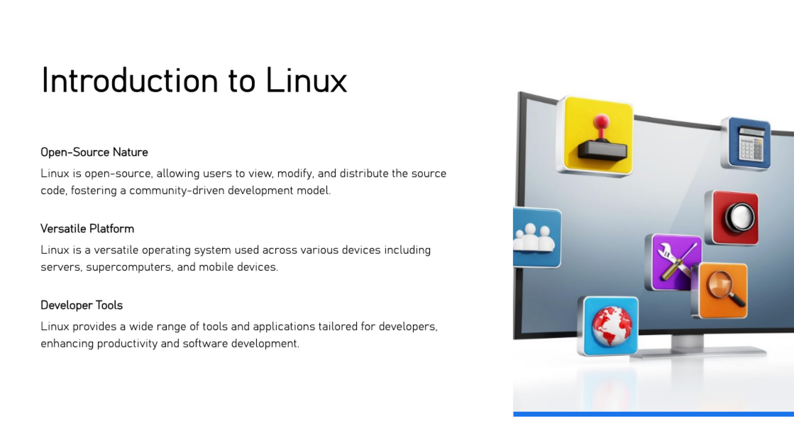

= Basic Linux Commands for Beginners
:toc: right
:toclevels:5
:sectnums:

== Introduction to Linux



=== What is Linux?

Linux is a family of open-source operating systems based on the Linux kernel. It is widely used in servers, desktops, mobile devices, and embedded systems. Key features include stability, security, and flexibility.

== Getting Started with the Terminal

*Opening and Using the Terminal*

* The terminal is a command-line interface for interacting with the Linux operating system.
* Shortcut keys to open the terminal:
  - `Ctrl+Alt+T` on Ubuntu.
  - Search for "Terminal" in the application menu.

== File and Directory Management

*Navigating the Filesystem*

* Use `pwd` to print the current working directory.
* Use `ls` to list the contents of a directory.
  - Options:
    - `ls -l`: Lists details such as permissions and size.
    - `ls -a`: Includes hidden files (starting with `.`).
* Use `cd` to change directories.

*Viewing the Current Directory*

* Command: `pwd`

* Example:
```bash
$ pwd
/home/user
```

*Listing Files and Directories*

* Command: `ls`
* Example:
```bash
$ ls -l
-rw-r--r-- 1 user user 1234 Sep 18 file.txt
```

*Changing Directories*

* Command: `cd <directory>`
* Example:
```bash
$ cd /home/user/Documents
```

*Creating Directories*

* Command: `mkdir <directory>`
* Example:
```bash
$ mkdir new_folder
```

*Creating Files*

* Command: `touch <filename>`
* Example:
```bash
$ touch new_file.txt
```

*Viewing File Content*

* Commands: `cat`, `less`, `more`
* Example:
```bash
$ cat file.txt
This is the content of the file.
```

*Copying Files*

* Command: `cp <source> <destination>`
* Example:
```bash
$ cp file.txt /home/user/backup/
```

*Moving and Renaming Files*

* Command: `mv <source> <destination>`
* Example:
```bash
$ mv file.txt new_file.txt
```

*Deleting Files and Directories*

* Command: `rm <file>`
* Example:
```bash
$ rm file.txt
```

== File Permissions and Ownership

*Understanding File Permissions*

* Command: `ls -l`
* Example:
```bash
$ ls -l file.txt
-rw-r--r-- 1 user user 1234 Sep 18 file.txt
```

*Changing Permissions*

* Command: `chmod <permissions> <file>`
* Example:
```bash
$ chmod 755 script.sh
```

*Changing Ownership*

* Command: `chown <owner>:<group> <file>`
* Example:
```bash
$ sudo chown user:group file.txt
```

*Searching and Finding Files*

*Searching with `find`*

* Command: `find <path> -name <pattern>`
* Example:
```bash
$ find /home/user -name "*.txt"
```

*Searching Within Files Using `grep`*

* Command: `grep <pattern> <file>`
* Example:
```bash
$ grep "error" log.txt
```

== Process Management

*Viewing Running Processe*

* Command: `ps`
* Example:
```bash
$ ps aux
```

*Managing Processes*

* Commands: `kill` and `killall`
* Example:
```bash
$ kill 1234
```

== Monitoring System Performance

* Commands: `top` and `htop`
* Example:
```bash
$ top
```

== Disk and System Information

Checking Disk Usage

* Commands: `df` and `du`
* Example:
```bash
$ df -h
```

*Viewing System Information*

* Commands: `uname`, `hostname`, `uptime`

* Example:
```bash
$ uname -a
```

== Archive and Compression Tools

*Creating and Extracting Archives*

* Command: `tar`
* Example:
```bash
$ tar -cvf archive.tar file.txt
$ tar -xvf archive.tar
```

*Compressing and Extracting Files*

* Commands: `gzip`, `gunzip`, `zip`, `unzip`
* Example:
```bash
$ gzip file.txt
$ gunzip file.txt.gz
```

== User Management

*Adding and Switching Users*

* Command: `adduser`, `su`
* Example:
```bash
$ sudo adduser new_user
$ su new_user
```

*Changing Passwords*

* Command: `passwd`
* Example:
```bash
$ passwd
```

== Helpful Shortcuts and Tricks

*Using `tab` for Autocomplete*

* Press `Tab` to autocomplete file or command names.

*Using `history`*

* Command: `history`
* Example:
```bash
$ history
```

*Canceling a Command*

* Shortcut: `Ctrl+C`

== Conclusion

* Learning basic Linux commands is essential for developers and system administrators.
* Practice these commands to build confidence and efficiency.
* Next steps: Explore intermediate Linux commands.
