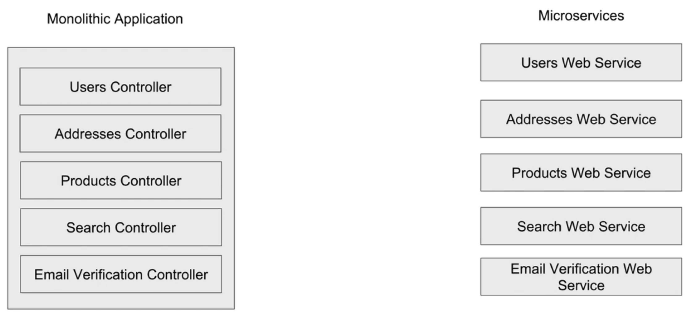
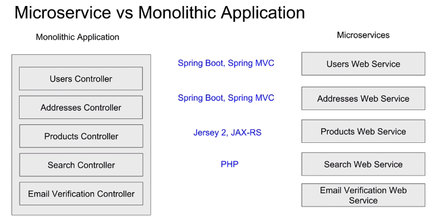
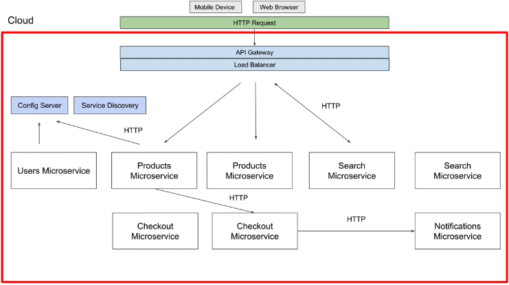

= Microservices
:toc: right
:toclevels: 5
:sectnums: 5


---



---



---




== What is Microservices Architecture?

Microservices architecture is a design pattern where an application is developed as a collection of small, independent services, each responsible for a specific functionality. These services communicate with each other using lightweight protocols, such as HTTP or messaging queues.

*Key Features of Microservices:*

* Each service is self-contained and focuses on a single business capability.
* Services are independently deployable and scalable.
* Services communicate via APIs, often RESTful APIs.
* Microservices are loosely coupled, meaning changes in one service rarely affect others.
* They can be developed and deployed using different programming languages and technologies.

== Benefits of Microservices Architecture

* **Scalability:** Services can be scaled independently based on their specific requirements.
* **Flexibility:** Teams can choose different technologies and frameworks for different services.
* **Fault Isolation:** Failures in one service are less likely to impact others.
* **Continuous Delivery:** Independent deployment of services accelerates the development lifecycle.
* **Improved Maintenance:** Smaller codebases are easier to manage and debug.

== Components of a Microservices Architecture

* **Service Discovery:**
* Used to dynamically discover the location of services.
* Examples: Eureka, Consul, Zookeeper.

* **API Gateway:**
* Acts as an entry point for client requests.
* Provides routing, authentication, and load balancing.
* Examples: Kong, AWS API Gateway, Zuul.

* **Load Balancer:**
* Distributes incoming requests among instances of a service to ensure high availability.

* **Database per Service:**
* Each service manages its database to ensure data independence and maintain loose coupling.

* **Message Broker:**
* Facilitates asynchronous communication between services.
* Examples: RabbitMQ, Apache Kafka.

* **Configuration Management:**
* Manages and centralizes configuration files.
* Examples: Spring Cloud Config, HashiCorp Vault.

* **Monitoring and Logging:**
* Helps track the health and performance of services.
* Examples: Prometheus, Grafana, ELK Stack (Elasticsearch, Logstash, Kibana).

== Communication in Microservices

Microservices communicate in two primary ways:

* **Synchronous Communication:**
* Services interact directly via RESTful APIs or gRPC.
* Example: Service A makes a real-time request to Service B for data.

* **Asynchronous Communication:**
* Services use message queues or event streams.
* Example: Service A sends a message to a queue, and Service B processes it later.

== Challenges in Microservices Architecture

* **Complexity:**
* Managing multiple services introduces operational complexity.

* **Data Management:**
* Handling transactions and consistency across services is challenging.

* **Latency:**
* Network calls between services can introduce delays.

* **Security:**
* Each service needs to handle authentication and authorization.

* **Monitoring:**
* Observing and debugging distributed systems is more complex.

== Tools and Technologies for Microservices

* **Orchestration and Deployment:**
* Docker, Kubernetes, OpenShift.

* **API Development:**
* Postman, Swagger/OpenAPI, REST Assured.

* **Service Mesh:**
* Istio, Linkerd.

== Best Practices

* **Design for Failure:**
* Implement retries, circuit breakers, and fallbacks.

* **Decentralized Governance:**
* Allow teams to choose appropriate tools and technologies.

* **Independent Deployments:**
* Use CI/CD pipelines for seamless deployment of services.

* **Focus on Domain-Driven Design:**
* Align services with business capabilities.

== Example Architecture Diagram

The architecture includes:

* Client interacts with the API Gateway.
* API Gateway routes requests to respective services.
* Services communicate with their databases.
* Asynchronous communication via a message broker.
* Centralized configuration and monitoring systems.

```
[architecture diagram placeholder]
  +-----------+      +-------------+      +-------------------+
  |   Client  | ---> | API Gateway | ---> |   Service A       |
  +-----------+      +-------------+      +-------------------+
                           |                      |
                           v                      v
                  +------------------+     +------------------+
                  |   Service B      |     |   Service C      |
                  +------------------+     +------------------+
```

== Case Study

*Scenario:* An e-commerce platform is divided into microservices:

* **User Service:** Handles user authentication and profile management.
* **Product Service:** Manages product catalog and inventory.
* **Order Service:** Processes and tracks orders.
* **Payment Service:** Handles payment processing.

*Communication:* Services use RESTful APIs for synchronous communication and a message broker for order updates.

== Conclusion

Microservices architecture is a robust solution for building scalable, flexible, and resilient applications. While it comes with its own set of challenges, following best practices and leveraging the right tools can make the transition smooth and effective.

== Messaging System

=== Kakfa / Topic

Kafka is like a **messaging system** used to send and receive data between different parts of an application or between applications.

- **How it works:** Imagine it as a "post office" where messages (data) are dropped into "mailboxes" (called *topics*). Other systems can pick up these messages whenever they need.
- **Why it's useful:** It helps handle large amounts of data quickly and ensures no data is lost.
- **Common use:** Sharing logs, analytics data, or live updates in real-time across services.

Think of it as a reliable courier service for your application's data!

=== Queue

A **queue** is a data structure that works on the principle of **First In, First Out (FIFO)**—the first item added is the first one removed.

*Example*:

Imagine a line at a ticket counter:
- People join the line at the back (enqueue).
- The person at the front gets served first and leaves the line (dequeue).

*In software*:

A queue is used when tasks need to be handled in order:
- A printer queue processes print jobs in the order they arrive.
- A customer service system processes support tickets one by one.

---

== Testing REST and Microservices

[cols="1,1,1", options="header"]
|===
| Testing Aspect                | REST API Testing                                   | Microservices Testing

| *Scope*
| Focuses on testing individual endpoints and their responses.
| Encompasses testing the interactions between multiple microservices and their endpoints.

| *Dependencies*
| Requires minimal or mocked dependencies, as it usually tests isolated services.
| Requires handling dependencies between services, including databases, queues, and other APIs.

| *Tools*
| Common tools: Postman, REST Assured, and Swagger.
| Involves tools like WireMock, Docker, and frameworks for integration testing.

| *Environment*
| Typically tested in development or staging environments.
| Requires distributed environments mimicking production setups for accurate results.

| *Complexity*
| Simpler as it deals with standalone services.
| More complex due to service interdependencies and failure scenarios.

| *Focus Areas*
| Validation of request/response formats, authentication, and CRUD operations.
| Includes API testing, service-to-service communication, data consistency, and resilience.

| *Resilience Testing*
| Not a major concern.
| Critical to test for failures, retries, and circuit breakers.

| *Performance*
| Focused on API latency and throughput.
| Focuses on performance at both service and system levels, including message queues and databases.

| *Scalability Testing*
| Typically not considered.
| Key to verify service behavior under load and scaling scenarios.

| *Debugging*
| Easier due to direct and isolated services.
| Complex due to distributed nature, requiring centralized logging and tracing tools.
|===


== Questions

* *What is the key benefit of using microservices architecture?*
A. Monolithic scalability
B. Independent deployment and scalability
C. Centralized development
D. Single point of failure

.Click Here For Answer
[%collapsible]
====
The answer is B
====

* *Which protocol is most commonly used for communication between microservices?*
A. SMTP
B. FTP
C. HTTP/HTTPS
D. SNMP

.Click Here For Answer
[%collapsible]
====
The answer is C
====

* *What is a common tool used for service discovery in microservices?*
A. Jenkins
B. Eureka
C. Selenium
D. Ansible

.Click Here For Answer
[%collapsible]
====
The answer is B
====

* *Which of the following is an advantage of using Docker in microservices?*
A. Tight coupling
B. Consistent runtime environment
C. Increases development time
D. Reduces scalability

.Click Here For Answer
[%collapsible]
====
The answer is B
====

* *Which design pattern is commonly used to handle service failures in microservices?*
A. Singleton
B. Circuit Breaker
C. Factory
D. Proxy

.Click Here For Answer
[%collapsible]
====
The answer is B
====

* *What is the role of an API Gateway in microservices?*
A. Direct communication between services
B. Aggregating requests and managing routing
C. Storing large datasets
D. Replacing the database

.Click Here For Answer
[%collapsible]
====
The answer is B
====

* *Which of the following is not a characteristic of microservices?*
A. Modular components
B. Independent deployability
C. Tight coupling
D. Scalability

.Click Here For Answer
[%collapsible]
====
The answer is C
====

* *What does eventual consistency in microservices mean?*
A. Data is always consistent
B. Data will become consistent over time
C. Data will never be consistent
D. Data is updated synchronously

.Click Here For Answer
[%collapsible]
====
The answer is B
====


* *What is the purpose of a distributed tracing tool in microservices?*
A. To monitor CPU usage
B. To trace requests across services
C. To manage deployment pipelines
D. To compress data

.Click Here For Answer
[%collapsible]
====
The answer is B
====


